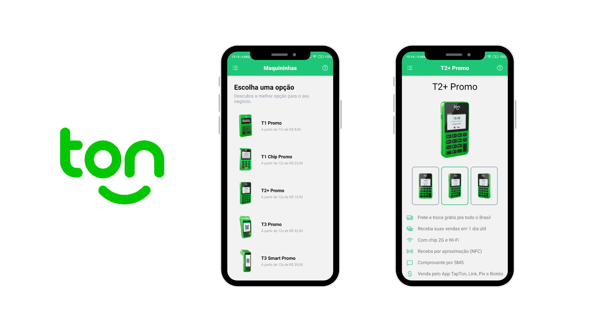

<div align="center"></div>

# Maquininha Ton 🪙

<div align="center"></div>

#### Listagem das maquininhas Ton, apresentando seus diferenciais e vantagens.

### 🧪 Tecnologias Utilizadas

- React Native
- Typescript
- Styled-component
- React Navigation
- Jest e Testing-library
- Storybook web
- Firebase

## 🚀 Como usar

#### Clonar o repositório

```bash
git clone https://github.com/gabriela-miranda-leite/maquininha.git
```

#### Instalar as dependências

```bash
npm install
```

#### Rodando o aplicativo

```bash
npm run android
```

e

```bash
npx react-native start
```

#### Storybook

```bash
npm run storybook
```

#### Tests e coverage

```bash
npm run stest -- --coverage.
```
